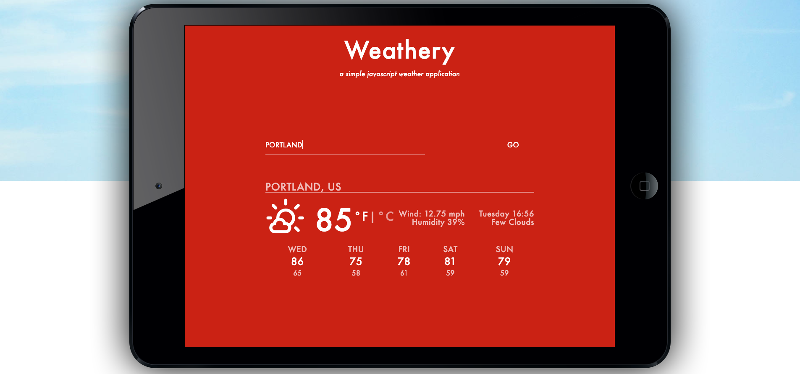

# Weathery

Weathery is a simple web application that provides weather information for a location based on user input. This JavaScript code, when integrated into a web page, allows users to enter a location, retrieve weather data from OpenWeatherMap API, and display the weather information in a user-friendly format.

## Screenshots

## JavaScript Functions

### titleCase

The `titleCase` function is used to capitalize the first letter of each word in a given string. It splits the input string by spaces, capitalizes the first letter of each word, and then joins the words back together with spaces.

### fullDay

The `fullDay` function converts a three-letter abbreviation of a day of the week (e.g., "Tue" for Tuesday) into the full day name (e.g., "Tuesday"). It uses a `switch` statement to map abbreviations to full names and returns the corresponding full day name.

### Initialization and AJAX Requests

The code uses jQuery to select various elements from the HTML page, such as the city name, temperature, weather description, wind speed, humidity, and forecast. It also makes AJAX requests to two different OpenWeatherMap API endpoints:

- `requestWeather` retrieves current weather data for a specified location.
- `requestForecast` retrieves a 6-day weather forecast for the same location.

### Temperature Unit Conversion

The code provides the ability to switch between Fahrenheit and Celsius temperature units. When a unit is clicked, it updates the displayed temperature accordingly.

### Weather Data Display

The code populates the HTML elements with weather data, including the city name, temperature, description, wind speed, humidity, and a weather icon. It also sets the background color and button style based on the temperature.

### Forecast Display

The code displays a 6-day weather forecast, allowing users to switch between Fahrenheit and Celsius units for the forecast data.

### Form Submission

The code handles form submission when a user enters a location and submits the form. It triggers the `getWeather` function with the input location and prevents the default form submission behavior.

## Usage

To use Weathery, you need to integrate this JavaScript code into an HTML page that includes the required HTML elements (e.g., input fields, display areas) and a valid OpenWeatherMap API key. Make sure to customize the API key in the code.

Please note that this is just the JavaScript portion of Weathery, and you need to set up the HTML structure and CSS styling separately to create a fully functional web application.

Feel free to modify and enhance this code as needed for your specific web development project.

**Author:** mconour

**License:** 

For additional information on setting up Weathery and using it with an HTML page, please refer to the source code and any accompanying documentation.